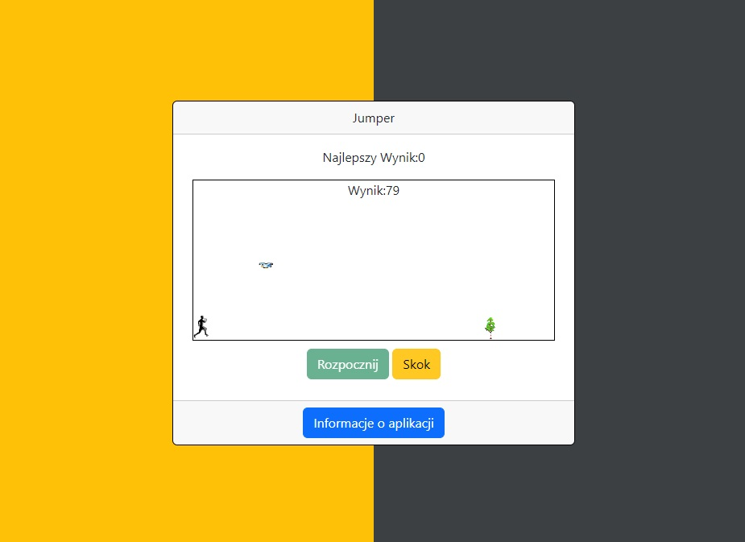

# :desktop_computer: Jumper

The application presents a board on which an obstacle moves, and after collecting a certain number of points, also an obstacle in the air. The user can control the character by using the "Jump" button. The player's goal is to avoid obstacles for as long as possible, earning points with each passing second. The current number of points is displayed in the middle of the screen. In case of collision with an obstacle, the game ends and starts again.

## :framed_picture: Screenshots

## :joystick: Demo

https://kamilkeder.github.io/Jumper/

## :e-mail: Feedback

If you have any feedback, please reach out to me at kontaktkkeder@gmail.com
